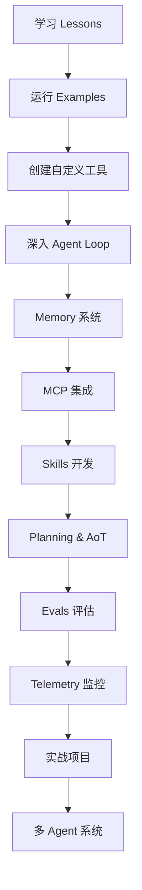

# Mini Agent 进阶学习计划

> 本计划适用于已经学习了 lessons 和 mini-agent 代码的学习者

## 📚 学习路线图

```
Week 1-2:  运行 examples → 创建自定义工具
Week 3-4:  深入 agent loop → Memory 系统
Week 5-6:  MCP 集成 → Skills 开发
Week 7-8:  Planning & AoT → 并行执行
Week 9-10: Evals → Telemetry → 监控
Week 11+:  实战项目 → 多 agent 系统
```

---

## 阶段一：实践与验证（1-2周）

### 1. 运行并修改 Examples

**目标**：通过实际运行加深理解

**任务**：
- 依次运行 `examples/01_basic_tools.py` 到 `examples/06_tool_schema_demo.py`
- 修改每个示例，添加自己的功能（如：在 calculator.py 中添加新的数学函数）
- 观察工具调用、错误处理、多轮对话的实际效果

**验证标准**：
- ✅ 所有示例都能成功运行
- ✅ 理解每个工具的调用流程
- ✅ 能够修改示例并添加新功能

---

### 2. 构建自定义工具

**目标**：掌握工具开发

**任务**：
- 阅读 `mini_agent/tools/base.py` 理解 `BaseTool` 接口
- 创建 3 个自定义工具：
  - **简单工具**：如天气查询、时间转换
  - **有状态工具**：如任务列表管理
  - **复杂工具**：如数据库查询、API 调用
- 将工具集成到 agent 中测试

**示例项目**：
```python
# 天气查询工具
class WeatherTool(BaseTool):
    name = "get_weather"
    description = "获取指定城市的天气信息"
    
    def execute(self, city: str) -> dict:
        # 实现天气查询逻辑
        pass
```

**验证标准**：
- ✅ 理解 BaseTool 接口的设计
- ✅ 能够独立创建工具并集成
- ✅ 工具能够正确处理错误情况

---

### 3. 深入理解 Agent Loop

**目标**：掌握 agent 执行流程

**任务**：
- 在 `mini_agent/agent.py` 中添加详细的日志
- 追踪一次完整的执行：用户输入 → 思考 → 工具调用 → 响应
- 理解 `max_steps`、错误恢复、上下文管理的机制

**关键代码位置**：
- `agent.py:run()` - 主执行循环
- `agent.py:_process_tool_calls()` - 工具调用处理
- `agent.py:_handle_error()` - 错误恢复

**验证标准**：
- ✅ 能够画出 agent loop 的流程图
- ✅ 理解每个步骤的输入输出
- ✅ 知道如何调试 agent 执行问题

---

## 阶段二：高级功能探索（2-3周）

### 4. Memory 系统实战

**目标**：构建持久化记忆系统

**任务**：
- 研究 `mini_agent/tools/note_tool.py`
- 扩展 Memory 功能：
  - **向量搜索**：使用 embeddings 实现语义搜索
  - **优先级管理**：重要记忆优先召回
  - **过期机制**：自动清理过时信息
  - **知识图谱**：构建关联记忆网络
- 测试跨会话的记忆效果

**技术栈**：
- 向量数据库：FAISS / ChromaDB
- Embedding 模型：OpenAI / Sentence Transformers
- 图数据库：NetworkX / Neo4j

**验证标准**：
- ✅ 实现语义搜索功能
- ✅ 记忆能够跨会话持久化
- ✅ 能够处理大量记忆（1000+ 条）

---

### 5. MCP 工具集成

**目标**：掌握外部工具集成

**任务**：
- 阅读 `mini_agent/tools/mcp_loader.py`
- 集成更多 MCP 服务器：
  - GitHub - 代码仓库操作
  - Slack - 消息发送
  - Database - 数据库查询
- 创建自己的 MCP 服务器
- 理解工具发现、加载、调用的完整流程

**参考资源**：
- [MCP 协议文档](https://github.com/modelcontextprotocol/protocol)
- [MCP Servers 仓库](https://github.com/modelcontextprotocol/servers)

**验证标准**：
- ✅ 成功集成至少 3 个 MCP 服务器
- ✅ 创建一个自定义 MCP 服务器
- ✅ 理解 MCP 的通信协议

---

### 6. Skills 系统研究

**目标**：理解复杂技能的组织方式

**任务**：
- 研究 `mini_agent/skills/` 下的现有技能
- 选择一个技能（如 `document-skills`）深入分析其架构
- 创建自己的 Skill：
  - 定义 skill manifest
  - 实现多步骤工作流
  - 添加依赖和配置管理

**Skill 结构**：
```
my-skill/
├── skill.yaml          # Skill 定义
├── README.md           # 使用文档
├── scripts/            # 执行脚本
│   ├── __init__.py
│   └── main.py
└── tests/              # 测试用例
    └── test_skill.py
```

**验证标准**：
- ✅ 理解 Claude Skills 的设计理念
- ✅ 创建一个可复用的 Skill
- ✅ Skill 能够被 agent 正确调用

---

## 阶段三：系统优化与生产化（2-4周）

### 7. Planning 系统优化

**目标**：实现更智能的规划

**任务**：
- 研究 Lesson 08 (Planning) 和 Lesson 10 (AoT)
- 实现依赖图的可视化
- 添加并行执行能力
- 实现动态规划调整（根据执行结果修改计划）

**核心概念**：
- **原子操作 (Atomic Actions)**：不可再分的最小任务单元
- **依赖图 (Dependency Graph)**：任务之间的依赖关系
- **并行执行**：独立任务同时执行
- **动态调整**：根据执行反馈修改计划

**实现要点**：
```python
# 依赖图示例
plan = {
    "actions": [
        {"id": "A", "deps": [], "action": "读取文件"},
        {"id": "B", "deps": ["A"], "action": "处理数据"},
        {"id": "C", "deps": ["A"], "action": "生成摘要"},
        {"id": "D", "deps": ["B", "C"], "action": "生成报告"}
    ]
}
# A 可以立即执行
# B 和 C 可以在 A 完成后并行执行
# D 必须等待 B 和 C 都完成
```

**验证标准**：
- ✅ 能够生成正确的依赖图
- ✅ 实现并行执行，提升效率
- ✅ 能够处理执行失败的情况

---

### 8. 评估系统（Evals）

**目标**：建立质量保证机制

**任务**：
- 研究 Lesson 11 (Evals)
- 创建测试用例集：
  - **工具调用准确性**：工具选择是否正确
  - **多步任务完成率**：复杂任务的完成情况
  - **错误恢复能力**：遇到错误时的处理
  - **输出质量**：生成内容的质量评估
- 实现自动化评估流水线
- 添加性能指标监控

**评估维度**：
1. **正确性 (Correctness)**：任务是否正确完成
2. **效率 (Efficiency)**：使用的步骤数和时间
3. **鲁棒性 (Robustness)**：处理异常的能力
4. **可解释性 (Interpretability)**：决策过程是否清晰

**测试框架**：
```python
class AgentEvaluation:
    def __init__(self, agent, test_cases):
        self.agent = agent
        self.test_cases = test_cases
    
    def run_evals(self):
        results = []
        for case in self.test_cases:
            result = self.evaluate_case(case)
            results.append(result)
        return self.generate_report(results)
```

**验证标准**：
- ✅ 创建至少 20 个测试用例
- ✅ 实现自动化评估流程
- ✅ 生成可视化的评估报告

---

### 9. 遥测与监控

**目标**：生产环境可观测性

**任务**：
- 研究 Lesson 12 (Telemetry)
- 集成日志系统（结构化日志）
- 添加性能追踪：
  - Token 使用量统计
  - 响应时间监控
  - 工具调用频率
  - 错误率追踪
- 实现错误告警机制
- 可视化 agent 执行流程

**监控指标**：
- **性能指标**：
  - 平均响应时间
  - Token 消耗率
  - 并发请求数
- **质量指标**：
  - 任务完成率
  - 工具调用成功率
  - 用户满意度
- **业务指标**：
  - 日活跃用户
  - 任务类型分布
  - 高频使用场景

**技术栈**：
- 日志：structlog / loguru
- 监控：Prometheus + Grafana
- 追踪：OpenTelemetry
- 可视化：Streamlit / Dash

**验证标准**：
- ✅ 实现完整的日志记录
- ✅ 搭建监控仪表板
- ✅ 能够快速定位问题

---

### 10. 上下文管理优化

**目标**：处理长对话和大规模任务

**任务**：
- 实现智能上下文压缩
- 添加对话摘要功能
- 实现上下文窗口滑动策略
- 测试极限场景（100+ 轮对话）

**策略**：
1. **摘要压缩**：定期总结历史对话
2. **重要性评分**：保留关键信息，丢弃冗余
3. **分层记忆**：短期 + 长期记忆
4. **检索增强**：按需加载相关上下文

**实现示例**：
```python
class ContextManager:
    def __init__(self, max_tokens=100000):
        self.max_tokens = max_tokens
        self.messages = []
        self.summary = ""
    
    def add_message(self, message):
        self.messages.append(message)
        if self.get_token_count() > self.max_tokens:
            self.compress()
    
    def compress(self):
        # 摘要旧消息
        old_messages = self.messages[:10]
        self.summary += self.summarize(old_messages)
        self.messages = self.messages[10:]
```

**验证标准**：
- ✅ 支持 100+ 轮对话
- ✅ Token 使用保持在合理范围
- ✅ 关键信息不丢失

---

## 阶段四：实战项目（持续）

### 11. 构建垂直领域 Agent

选择一个方向，构建完整的应用：

#### 选项 A：代码助手

**功能**：
- 代码审查 agent
- 重构建议 agent  
- 文档生成 agent
- 测试用例生成

**技术要点**：
- AST 解析
- 静态代码分析
- Git 集成
- IDE 插件开发

---

#### 选项 B：数据分析 Agent

**功能**：
- 自动化数据清洗
- 统计分析和可视化
- 报告自动生成
- 异常检测

**技术要点**：
- Pandas / Polars
- Matplotlib / Plotly
- 统计建模
- 自然语言生成

---

#### 选项 C：内容创作 Agent

**功能**：
- 多平台内容生成
- SEO 优化建议
- 图文自动排版
- 内容质量评估

**技术要点**：
- 文本生成优化
- 图像处理
- HTML/CSS 生成
- 内容分发

---

#### 选项 D：DevOps Agent

**功能**：
- 自动化部署
- 日志分析和告警
- 故障诊断和恢复
- 性能优化建议

**技术要点**：
- CI/CD 集成
- 日志解析
- 监控系统
- 自动化脚本

---

### 12. 多 Agent 协作系统

**目标**：构建 agent 网络

**任务**：
- 实现 agent 间通信协议
- 构建任务分发机制
- 实现协作规划
- 添加冲突解决策略

**架构设计**：
```
Coordinator Agent (协调者)
    ↓
    ├── Specialist Agent 1 (专家1)
    ├── Specialist Agent 2 (专家2)
    └── Specialist Agent 3 (专家3)
```

**协作模式**：
1. **Pipeline**：串行协作，输出传递
2. **Parallel**：并行协作，结果聚合
3. **Debate**：多 agent 辩论，达成共识
4. **Hierarchical**：层次化管理

**实现要点**：
```python
class MultiAgentSystem:
    def __init__(self):
        self.coordinator = CoordinatorAgent()
        self.specialists = [
            CodeAgent(),
            DataAgent(),
            WritingAgent()
        ]
    
    async def execute_task(self, task):
        # 1. 协调者分析任务
        plan = await self.coordinator.plan(task)
        
        # 2. 分配给专家
        results = []
        for subtask in plan.subtasks:
            agent = self.select_agent(subtask)
            result = await agent.execute(subtask)
            results.append(result)
        
        # 3. 聚合结果
        final_result = await self.coordinator.aggregate(results)
        return final_result
```

**验证标准**：
- ✅ 实现至少 2 种协作模式
- ✅ 能够处理复杂的多步任务
- ✅ Agent 间能够有效通信

---

## 学习资源与工具

### 📖 推荐阅读

#### 论文：
1. **ReAct: Synergizing Reasoning and Acting in Language Models**
   - 链接：https://arxiv.org/abs/2210.03629
   - 核心：推理和行动的结合

2. **Chain-of-Thought Prompting Elicits Reasoning in LLMs**
   - 链接：https://arxiv.org/abs/2201.11903
   - 核心：思维链提示

3. **Tree of Thoughts: Deliberate Problem Solving with LLMs**
   - 链接：https://arxiv.org/abs/2305.10601
   - 核心：树状思维结构

4. **Reflexion: Language Agents with Verbal Reinforcement Learning**
   - 链接：https://arxiv.org/abs/2303.11366
   - 核心：自我反思和改进

#### 开源项目：
- **LangChain**：Agent 框架
- **AutoGPT**：自主 Agent 实现
- **BabyAGI**：任务驱动的自主 Agent
- **Claude Skills**：高质量 Skill 示例
- **MCP Servers**：标准工具集成

---

### 🛠️ 调试技巧

#### 1. 详细日志
```python
import logging
logging.basicConfig(level=logging.DEBUG)
```

#### 2. 断点调试
```python
# 在关键位置添加断点
import pdb; pdb.set_trace()
```

#### 3. 可视化思考过程
```python
def visualize_thinking(agent):
    for step in agent.steps:
        print(f"Step {step.number}:")
        print(f"  Thought: {step.thought}")
        print(f"  Action: {step.action}")
        print(f"  Result: {step.result}")
```

#### 4. 记录所有交互
```python
class LoggingLLMClient:
    def __init__(self, client):
        self.client = client
        self.logs = []
    
    async def chat(self, messages):
        self.logs.append({"input": messages})
        response = await self.client.chat(messages)
        self.logs.append({"output": response})
        return response
```

---

### 📊 每周检查点

建议每周回答以下问题：

1. ✅ **理解检验**：我能用自己的话解释这周学习的概念吗？
2. ✅ **实践能力**：我能独立实现相关功能吗？
3. ✅ **问题记录**：我遇到了什么问题？如何解决的？
4. ✅ **目标设定**：下周的学习目标是什么？

**学习日志模板**：
```markdown
# Week X 学习日志

## 学习内容
- 完成了...
- 阅读了...
- 实现了...

## 收获
- 理解了...
- 掌握了...

## 遇到的问题
- 问题1：...
  - 解决方案：...
- 问题2：...
  - 解决方案：...

## 下周计划
- [ ] 任务1
- [ ] 任务2
- [ ] 任务3
```

---

## 学习建议

### 🎯 学习原则

1. **理论与实践结合**
   - 先理解概念，再动手实现
   - 不要只看代码，要运行和修改

2. **循序渐进**
   - 不要跳步，扎实掌握每个阶段
   - 遇到困难回到基础重新理解

3. **主动思考**
   - 问"为什么这样设计？"
   - 思考"如果我来做会怎么做？"

4. **记录总结**
   - 写学习笔记
   - 记录遇到的问题和解决方案
   - 分享你的理解和心得

5. **寻求反馈**
   - 在社区提问
   - 与其他学习者交流
   - 参与开源贡献

---

### 🚀 快速开始

**现在就开始！从这里开始你的第一步：**

```bash
# 1. 运行第一个示例
cd Mini-Agent
uv run python examples/01_basic_tools.py

# 2. 修改示例，添加你自己的功能
# 3. 观察输出，理解执行流程
# 4. 尝试创建你的第一个自定义工具
```

**第一周目标**：
- ✅ 运行所有 examples
- ✅ 创建 1-2 个自定义工具
- ✅ 理解 agent loop 的基本流程

---

## 学习路径图



---

## 参考资源

### 官方文档
- [Mini Agent README](../README.md)
- [开发指南](./DEVELOPMENT_GUIDE.md)
- [生产部署指南](./PRODUCTION_GUIDE.md)
- [Lessons 目录](./lessons/)

### 社区
- [GitHub Issues](https://github.com/MiniMax-AI/Mini-Agent/issues)
- [Discussions](https://github.com/MiniMax-AI/Mini-Agent/discussions)
- MiniMax 官方微信群

### 相关项目
- [Claude Skills](https://github.com/anthropics/skills)
- [MCP Protocol](https://github.com/modelcontextprotocol/protocol)
- [MCP Servers](https://github.com/modelcontextprotocol/servers)

---

## 贡献指南

在学习过程中，你可以：
- 提交 bug 报告
- 改进文档
- 分享学习笔记
- 贡献代码示例
- 创建新的 Skills

**欢迎在学习过程中为社区做出贡献！**

---

**祝学习愉快！🎉**

如有问题，欢迎在 GitHub Issues 中提问。
